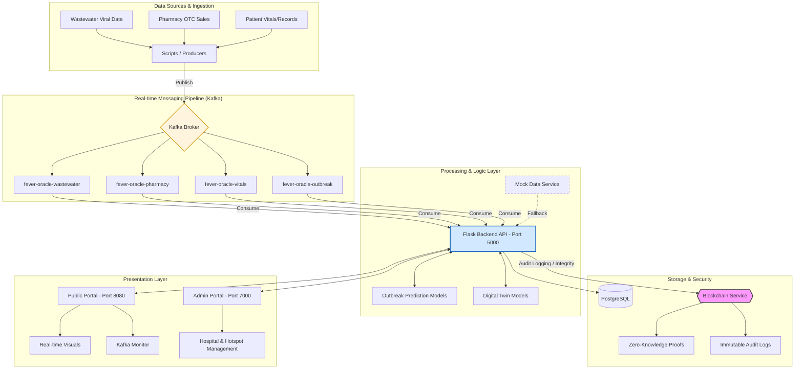

# Fever Oracle

Fever Oracle is a comprehensive healthcare monitoring system that uses machine learning to predict fever outbreaks and assess individual patient risk. It provides a centralized dashboard to visualize patient data, track potential health issues, and generate early warnings.

## Features

### Public Portal (Port 8080)
- **Dashboard**: Real-time overview of outbreak predictions, patient status, and system metrics
- **Patient Risk Assessment**: ML-based individualized risk assessment using digital twin models
- **Alerts**: Cross-institutional federated learning and early warning system
- **Kafka Monitor Page**: Real-time Kafka pipeline monitoring, data streams, and ML model predictions
- **Blockchain Security**: Immutable audit logging, data integrity verification, and zero-knowledge proofs
- **Wastewater Monitoring**: Integration with wastewater viral load data
- **Pharmacy Data**: OTC medication sales trend analysis
- **Mock Data & Models**: Works with mock data when Kafka is unavailable for demonstration
- **Responsive Design**: Works seamlessly on desktop and mobile devices
- **Secure Authentication**: Login system with credential validation

### Admin Portal (Port 7000)
- **Admin Dashboard**: Overview statistics (hospitals, patients, hotspots, alerts)
- **Hospitals Management**: View connected hospitals and their active cases
- **Hotspots Monitoring**: Track predicted outbreak hotspots with risk levels
- **Alerts Management**: System alerts with similarity match scores
- **Clean Admin UI**: Modern TailwindCSS dashboard with sidebar navigation

## Architecture

The Fever Oracle system consists of two frontend applications:

1. **Public Portal** (Port 8080): Main user-facing application for monitoring and predictions
2. **Admin Portal** (Port 7000): Administrative dashboard for system management

Both portals connect to the same backend API (Port 5000).

```
fever-oracle/
├── backend/                    # Flask REST API
│   ├── app.py                 # Main Flask application (includes admin endpoints)
│   ├── blockchain_service.py  # Blockchain API endpoints
│   ├── kafka_service.py       # Kafka monitoring and data access
│   ├── config/                # Configuration files
│   │   ├── kafka_topics.json  # Kafka topic configuration
│   │   └── blockchain_config.json  # Blockchain settings
│   ├── middleware/            # Middleware components
│   │   └── cache.py           # Response caching
│   ├── models/                # Data models
│   │   ├── blockchain.py      # Blockchain implementation (with caching)
│   │   ├── mock_model.py      # Mock ML models for demonstration
│   │   ├── patient.py         # Patient data model
│   │   └── outbreak.py        # Outbreak prediction model
│   └── requirements.txt       # Python dependencies
├── frontend/                  # React + TypeScript frontend (Public Portal - Port 8080)
│   ├── src/                  # Source code
│   │   ├── lib/
│   │   │   ├── blockchain.ts # Blockchain API client
│   │   │   └── api.ts        # General API client
│   │   ├── pages/            # Page components
│   │   │   ├── KafkaMonitor.tsx  # Kafka monitoring page
│   │   │   ├── Dashboard.tsx
│   │   │   ├── PatientRisk.tsx
│   │   │   └── Alerts.tsx
│   │   └── components/       # UI components
│   │       ├── KafkaMonitor.tsx  # Kafka stats component
│   │       ├── RealtimeDataStream.tsx  # Data stream component
│   │       ├── ModelPredictions.tsx  # Model predictions component
│   │       └── ErrorBoundary.tsx  # Error handling
│   ├── package.json          # Node dependencies
│   └── vite.config.ts        # Vite configuration
├── admin-portal/             # React + Vite Admin Portal (Port 7000)
│   ├── src/
│   │   ├── pages/            # Admin pages
│   │   │   ├── Dashboard.jsx      # Admin dashboard
│   │   │   ├── Hospitals.jsx      # Hospitals management
│   │   │   ├── Hotspots.jsx       # Hotspots monitoring
│   │   │   └── Alerts.jsx         # Alerts management
│   │   ├── layouts/          # Layout components
│   │   │   └── DashboardLayout.jsx  # Sidebar layout
│   │   ├── components/       # Reusable components
│   │   │   ├── StatCard.jsx
│   │   │   ├── LoadingSpinner.jsx
│   │   │   └── ErrorMessage.jsx
│   │   └── lib/              # Utilities
│   │       ├── api.js        # Axios API client
│   │       └── utils.js      # Helper functions
│   ├── package.json
│   └── vite.config.js        # Vite config (port 7000)
├── data/                     # Data files
│   ├── wastewater_demo.csv
│   ├── otc_demo.csv
│   └── patients_demo.jsonl
├── models/                   # ML models
│   ├── outbreak/            # Outbreak prediction models
│   └── twin/                # Patient digital twin models
├── scripts/                  # Utility scripts
│   ├── kafka_data_producer.py  # Kafka data producer
│   ├── kafka_data_consumer.py  # Kafka data consumer
│   ├── ingest_wastewater.py
│   └── generate_synthetic_vitals.py
├── docs/                     # Documentation
│   └── architecture.md
└── docker-compose.yml        # Docker orchestration
```

## Flow Diagram 


## Technologies Used

### Frontend
- **React 18**: UI library
- **TypeScript**: Type-safe JavaScript
- **Vite**: Fast build tool
- **Tailwind CSS**: Utility-first CSS framework
- **shadcn/ui**: Reusable component library
- **Recharts**: Data visualization
- **React Router**: Client-side routing

### Backend
- **Flask**: Python web framework
- **Flask-CORS**: Cross-origin resource sharing
- **Python 3.11+**: Programming language
- **Blockchain**: Immutable audit logging and data integrity
- **Cryptography**: Enhanced security and privacy features
- **Kafka-Python**: Apache Kafka client library for data streaming

### Infrastructure
- **Docker**: Containerization
- **Docker Compose**: Multi-container orchestration
- **PostgreSQL**: Database (optional)
- **Apache Kafka**: Real-time data streaming pipeline
- **Zookeeper**: Kafka coordination service

## Getting Started

### Quick Start (Mock Mode - No Kafka Required)

The system works in **mock mode** without Kafka for quick demonstration:

1. **Start Backend:**
   ```bash
   cd backend
   pip install -r requirements.txt
   python app.py
   ```
   Backend will run on `http://localhost:5000`

2. **Start Frontend:**
   ```bash
   cd frontend
   npm install
   npm run dev
   ```
   Frontend will run on `http://localhost:8080`

3. **Access Kafka Monitor:**
   - Navigate to `http://localhost:8080/kafka-monitor`
   - All features work with mock data automatically
   - No Kafka setup required!

### Prerequisites

- **Node.js** 18+ and npm
- **Python** 3.11+
- **Docker** and Docker Compose (optional, for full Kafka setup)

### Installation

1. **Clone the repository**
   ```bash
   git clone <YOUR_GIT_URL>
   cd fever-oracle
   ```

2. **Backend Setup**
   ```bash
   cd backend
   pip install -r requirements.txt
   python app.py
   ```
   Backend will run on `http://localhost:5000`

3. **Frontend Setup**
   ```bash
   cd frontend
   npm install
   npm run dev
   ```
   Frontend will run on `http://localhost:8080`

### Docker Setup (Recommended)

1. **Start all services**
   ```bash
   docker-compose up -d
   ```
   This starts:
   - Backend API (port 5000)
   - Frontend (port 8080)
   - PostgreSQL (port 5432)
   - Zookeeper (port 2181)
   - Kafka (port 9092)
   - Kafka Producer (generates realistic data automatically)

2. **View logs**
   ```bash
   docker-compose logs -f
   ```

3. **Stop services**
   ```bash
   docker-compose down
   ```

## Kafka Data Pipeline

The system uses Apache Kafka for real-time data generation and streaming. The Kafka pipeline generates realistic raw data for all mock data sources.

### Kafka Topics

- **`fever-oracle-wastewater`**: Wastewater viral load data with temporal patterns
- **`fever-oracle-pharmacy`**: Pharmacy OTC sales data with day-of-week effects
- **`fever-oracle-patients`**: Patient records with realistic demographics
- **`fever-oracle-vitals`**: Patient vital signs with correlated measurements
- **`fever-oracle-alerts`**: System alerts based on thresholds
- **`fever-oracle-outbreak`**: Outbreak predictions with confidence scores

### Data Generation Features

The Kafka producer generates realistic data with:

- **Temporal Patterns**: Morning/evening peaks, weekday/weekend variations
- **Correlated Data**: Fever affects heart rate, symptoms affect risk scores
- **Realistic Distributions**: Age-based comorbidities, region-based variations
- **Event-Based**: Random fever spikes, alert generation based on thresholds
- **Time-of-Day Effects**: Higher pharmacy sales in afternoon/evening
- **Seasonal Factors**: Weekly patterns in wastewater data

### Running Kafka Producers

**Using Docker (Automatic):**
The Kafka producer runs automatically when you start Docker Compose.

**Manual Setup:**
```bash
# Install dependencies
pip install kafka-python pandas numpy

# Run all producers
python scripts/kafka_data_producer.py

# Run specific producer
python scripts/kafka_data_producer.py --topic wastewater --interval 60

# With custom Kafka server
python scripts/kafka_data_producer.py --bootstrap-servers localhost:9092
```

### Running Kafka Consumers

```bash
# Consume and save data to files
python scripts/kafka_data_consumer.py
```

This will create/update data files in the `data/` directory:
- `wastewater_demo.csv`
- `otc_demo.csv`
- `patients_demo.jsonl`
- `patient_vitals.jsonl`
- `alerts_demo.jsonl`
- `outbreak_predictions.jsonl`

### Kafka Configuration

Kafka is configured in `docker-compose.yml`:
- **Bootstrap Server**: `localhost:9092` (external), `kafka:9093` (internal)
- **Auto-create Topics**: Enabled
- **Replication Factor**: 1 (for development)

Kafka topics are configured in `backend/config/kafka_topics.json`:
- Topic definitions with partitions and retention policies
- Consumer group configurations
- Producer settings

### Mock Mode

The system includes comprehensive mock data and models that work even when Kafka is not running:
- **Mock Kafka Data**: Automatically generated when Kafka is unavailable
- **Mock ML Models**: `backend/models/mock_model.py` provides realistic predictions
- **Graceful Degradation**: All features work in mock mode for demonstration

To use mock mode:
1. Simply start the backend (Kafka not required)
2. Navigate to `/kafka-monitor` page
3. All components will show mock data automatically
4. Model predictions work with mock data

### Kafka Monitor Page

Access the Kafka Monitor page at `/kafka-monitor` to see:
1. **Kafka Statistics**: Real-time message throughput and topic status
2. **Data Stream**: Live messages from Kafka topics (or mock data)
3. **Model Predictions**: ML predictions using Kafka data (or mock data)

The page works in three modes:
- **Live Mode**: When Kafka is running and producing data
- **Mock Mode**: When Kafka is unavailable (automatic fallback)
- **Hybrid Mode**: Mix of live and mock data

## API Endpoints

### Health Check
- `GET /api/health` - System health status

### Patients
- `GET /api/patients` - List all patients
- `GET /api/patients/<id>` - Get specific patient

### Data Sources
- `GET /api/wastewater` - Wastewater viral load data
- `GET /api/pharmacy` - Pharmacy OTC sales data

### Predictions & Alerts
- `GET /api/outbreak/predictions?days=14` - Outbreak predictions
- `GET /api/alerts?severity=high` - System alerts
- `GET /api/dashboard/metrics` - Dashboard metrics

### Kafka & Model
- `GET /api/kafka/stats` - Kafka statistics and throughput
- `GET /api/kafka/latest-data?topics=wastewater,pharmacy` - Latest Kafka messages
- `POST /api/model/predict` - Run ML prediction on Kafka data

### Admin Portal API
- `GET /admin/stats` - Admin dashboard statistics (hospitals, patients, hotspots, alerts)
- `GET /admin/hospitals` - List of connected hospitals with case counts
- `GET /admin/hotspots` - Predicted outbreak hotspots with risk levels
- `GET /admin/alerts` - System alerts with similarity match scores

### Blockchain & Security
- `GET /api/blockchain/info` - Get blockchain information and status
- `POST /api/blockchain/audit` - Add audit log entry to blockchain
- `GET /api/blockchain/audit-trail` - Retrieve audit trail (optional: filter by user_id or resource)
- `GET /api/blockchain/verify` - Verify blockchain integrity
- `POST /api/blockchain/data-hash` - Store data integrity hash on blockchain
- `POST /api/blockchain/zk-proof` - Create zero-knowledge proof for privacy-preserving verification

## Data Files

The system uses demo data files located in the `data/` directory:

- **wastewater_demo.csv**: Wastewater monitoring data with viral load measurements
- **otc_demo.csv**: Over-the-counter medication sales data
- **patients_demo.jsonl**: Patient records with vital signs and risk factors

## Scripts

### Data Ingestion
```bash
python scripts/ingest_wastewater.py
```

### Generate Synthetic Data
```bash
python scripts/generate_synthetic_vitals.py
```

## Development

### Backend Development
```bash
cd backend
export FLASK_ENV=development
python app.py
```

### Frontend Development (Public Portal)
```bash
cd frontend
npm run dev
```
Public Portal runs on `http://localhost:8080`

### Admin Portal Development
```bash
cd admin-portal
npm run dev
```
Admin Portal runs on `http://localhost:7000`

### Running Tests
```bash
# Backend tests (when implemented)
cd backend
pytest

# Frontend tests (when implemented)
cd frontend
npm test
```

## Project Structure

- **backend/**: Flask REST API server
  - `app.py`: Main application file with blockchain integration
  - `blockchain_service.py`: Blockchain API endpoints
  - `models/`: Data models and schemas
    - `blockchain.py`: Blockchain implementation (nodes, chain, privacy features)
    - `patient.py`: Patient data model
    - `outbreak.py`: Outbreak prediction model
- **frontend/**: React frontend application
  - `src/pages/`: Page components (Dashboard, Alerts, Patient Risk, Login)
  - `src/components/`: Reusable UI components
  - `src/lib/`: Utility functions and API clients
    - `blockchain.ts`: Blockchain API client
    - `api.ts`: General API client
    - `mockData.ts`: Mock data for development
- **models/**: Machine learning models
  - `outbreak/`: Outbreak prediction models
  - `twin/`: Patient digital twin models
- **scripts/**: Utility and data processing scripts
- **data/**: Demo and sample data files
- **docs/**: Documentation including architecture details

## Docker Deployment

### Quick Start with Docker Compose

1. **Start all services:**
   ```bash
   docker-compose up -d --build
   ```

2. **Check service status:**
   ```bash
   docker-compose ps
   ```

3. **View logs:**
   ```bash
   docker-compose logs -f
   ```

4. **Access the applications:**
   - **Public Portal**: http://localhost:8080
   - **Admin Portal**: http://localhost:7000
   - **Backend API**: http://localhost:5000
   - **Kafka Monitor**: http://localhost:8080/kafka-monitor

5. **Stop services:**
   ```bash
   docker-compose down
   ```

**Note**: The system works in mock mode even without Kafka. If Kafka services fail to start, the backend will automatically use mock data.

For detailed Docker setup instructions, see [DOCKER_SETUP.md](DOCKER_SETUP.md).

### Admin Portal Setup

The Admin Portal runs separately on port 7000:

**Local Development:**
```bash
cd admin-portal
npm install
npm run dev
# Access at http://localhost:7000
```

**Docker:**
```bash
# Start admin portal
docker-compose up -d admin-portal

# Or start all services
docker-compose up -d
```

For detailed Admin Portal setup, see [admin-portal/ADMIN_PORTAL_SETUP.md](admin-portal/ADMIN_PORTAL_SETUP.md).

## Environment Variables

Create a `.env` file in the root directory (optional for Docker):

```env
# Backend
FLASK_ENV=development
PORT=5000
KAFKA_BOOTSTRAP_SERVERS=kafka:9093

# Frontend (Public Portal)
VITE_API_URL=http://localhost:5000

# Admin Portal
# Create admin-portal/.env file:
VITE_API_URL=http://localhost:5000

# Database
POSTGRES_DB=fever_oracle
POSTGRES_USER=fever_user
POSTGRES_PASSWORD=fever_password
```

## Contributing

1. Fork the repository
2. Create a feature branch (`git checkout -b feature/amazing-feature`)
3. Commit your changes (`git commit -m 'Add some amazing feature'`)
4. Push to the branch (`git push origin feature/amazing-feature`)
5. Open a Pull Request

## Ports Summary

| Service | Port | Description |
|---------|------|-------------|
| Backend API | 5000 | Flask REST API |
| Public Portal | 8080 | Main user-facing React app |
| Admin Portal | 7000 | Administrative dashboard |
| PostgreSQL | 5432 | Database |
| Kafka (external) | 9092 | Kafka broker (external access) |
| Kafka (internal) | 9093 | Kafka broker (internal Docker network) |
| Zookeeper | 2181 | Kafka coordination service |

## License

This project is licensed under the MIT License.

## Blockchain Technology

Fever Oracle integrates blockchain technology to provide enhanced data security, privacy, and compliance capabilities.

### Key Blockchain Features

#### 1. Immutable Audit Logging
- All data access and modifications are automatically logged to the blockchain
- Creates an unalterable audit trail that meets HIPAA/GDPR compliance requirements
- Every patient data access is recorded with timestamp, user ID, and action details
- Audit logs cannot be modified or deleted, ensuring complete transparency

#### 2. Data Integrity Verification
- Data hashes are stored on the blockchain to verify data hasn't been tampered with
- Enables verification of data authenticity at any point in time
- Protects against unauthorized data modifications
- Supports compliance audits and regulatory requirements

#### 3. Zero-Knowledge Proofs
- Privacy-preserving verification without exposing sensitive patient data
- Allows verification of data properties without revealing the actual data
- Enables secure cross-institutional collaboration
- Maintains patient privacy while ensuring data integrity

#### 4. Proof of Work Consensus
- Blocks are mined using configurable difficulty levels
- Ensures blockchain security through computational work
- Prevents tampering and maintains chain integrity
- Configurable mining difficulty for different security requirements

### Blockchain Architecture

```
┌─────────────────────────────────────────┐
│         Application Layer               │
│  (Patient Data, Alerts, Predictions)   │
└──────────────┬──────────────────────────┘
               │
               ▼
┌─────────────────────────────────────────┐
│         Blockchain Layer                │
│  ┌──────────────────────────────────┐  │
│  │  Audit Logging                   │  │
│  │  - Data Access Logs              │  │
│  │  - User Actions                  │  │
│  │  - System Events                 │  │
│  └──────────────────────────────────┘  │
│  ┌──────────────────────────────────┐  │
│  │  Data Integrity                  │  │
│  │  - Hash Storage                  │  │
│  │  - Verification                  │  │
│  │  - Tamper Detection              │  │
│  └──────────────────────────────────┘  │
│  ┌──────────────────────────────────┐  │
│  │  Privacy Features                │  │
│  │  - Zero-Knowledge Proofs         │  │
│  │  - Encrypted Audit Logs          │  │
│  │  - Privacy-Preserving Operations │  │
│  └──────────────────────────────────┘  │
└─────────────────────────────────────────┘
```

### Blockchain Benefits

1. **Compliance**: Meets HIPAA and GDPR requirements for audit logging
2. **Security**: Immutable records prevent unauthorized modifications
3. **Transparency**: Complete audit trail for all data operations
4. **Privacy**: Zero-knowledge proofs enable verification without data exposure
5. **Trust**: Decentralized architecture eliminates single points of failure
6. **Integrity**: Cryptographic verification ensures data authenticity

### Using Blockchain Features

#### View Blockchain Status
```bash
curl http://localhost:5000/api/blockchain/info
```

#### Add Audit Log
```bash
curl -X POST http://localhost:5000/api/blockchain/audit \
  -H "Content-Type: application/json" \
  -d '{
    "event_type": "data_access",
    "user_id": "dijo-10101",
    "action": "view_patient",
    "resource": "patient/PT-2847",
    "metadata": {}
  }'
```

#### Get Audit Trail
```bash
# Get all audit logs
curl http://localhost:5000/api/blockchain/audit-trail

# Filter by user
curl http://localhost:5000/api/blockchain/audit-trail?user_id=dijo-10101

# Filter by resource
curl http://localhost:5000/api/blockchain/audit-trail?resource=patient/PT-2847
```

#### Verify Blockchain Integrity
```bash
curl http://localhost:5000/api/blockchain/verify
```

### Security & Privacy

- **End-to-End Encryption**: All sensitive data is encrypted in transit and at rest
- **Blockchain Audit Trail**: Immutable logging of all data access
- **Zero-Knowledge Proofs**: Privacy-preserving data verification
- **Access Control**: Role-based access with blockchain-verified permissions
- **Data Integrity**: Cryptographic hashing ensures data hasn't been tampered with
- **Compliance**: HIPAA/GDPR compliant architecture with audit logging

## Support

For issues and questions, please open an issue on GitHub.
